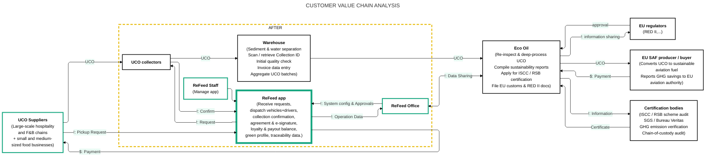

# CVCA: ReFeed (Customer Value Chain Analysis, AFTER)

> Mermaid flowchart redrawn from the CVCA image. Uses the ELK layout (`layout: elk`), which needs Mermaid 11 or later (mermaid.live works).

```mermaid
---
title: CUSTOMER VALUE CHAIN ANALYSIS
config:
  layout: elk
  theme: base
  themeVariables:
    fontFamily: Times New Roman, serif
    fontSize: 14px
    lineColor: "#000000"
    edgeLabelBackground: "#eafaf4"
  flowchart:
    curve: linear
    nodeSpacing: 50
    rankSpacing: 80
    htmlLabels: true
---
flowchart LR
  SUP["<b>UCO Suppliers</b><br/>(Large-scale hospitality<br/>and F&B chains<br/>+ small and medium-<br/>sized food businesses)"]

  subgraph AFTER ["AFTER"]
    direction LR
    COL["<b>UCO collectors</b>"]
    WH["<b>Warehouse</b><br/>(Sediment & water separation<br/>Scan / retrieve Collection ID<br/>Initial quality check<br/>Invoice data entry<br/>Aggregate UCO batches)"]
    APP["<b>ReFeed app</b><br/>(Receive requests,<br/>dispatch vehicles+drivers,<br/>collection confirmation,<br/>agreement & e-signature,<br/>loyalty & payout balance,<br/>green profile, traceability data.)"]
    OFF["<b>ReFeed Office</b>"]
    STAFF["<b>ReFeed Staff</b><br/>(Manage app)"]
  end

  ECO["<b>Eco Oil</b><br/>(Re-inspect & deep-process UCO<br/>Compile sustainability reports<br/>Apply for ISCC / RSB certification<br/>File EU customs & RED II docs)"]
  REG["<b>EU regulators</b><br/>(RED II,...)"]
  SAF["<b>EU SAF producer / buyer</b><br/>(Converts UCO to sustainable<br/>aviation fuel<br/>Reports GHG savings to EU<br/>aviation authority)"]
  CERT["<b>Certification bodies</b><br/>(ISCC / RSB scheme audit<br/>SGS / Bureau Veritas<br/>GHG emission verification<br/>Chain-of-custody audit)"]

  SUP -->|"UCO"| COL
  SUP -->|"!: Pickup Request"| APP
  APP -->|"$: Payment"| SUP
  COL -->|"!: Confirm"| APP
  APP -->|"!: Request"| COL
  COL -->|"UCO"| WH
  WH -->|"UCO"| ECO
  STAFF --> APP
  OFF -->|"!: System config & Approvals"| APP
  APP -->|"!: Operation Data"| OFF
  OFF <-->|"!: Data Sharing"| ECO
  REG -->|"approval"| ECO
  ECO -->|"!: information sharing"| REG
  ECO -->|"UCO"| SAF
  SAF -->|"$: Payment"| ECO
  ECO -->|"!: Information"| CERT
  CERT -->|"Certificate"| ECO

  classDef ext fill:#ffffff,stroke:#000000,stroke-width:2px,color:#000000;
  classDef rf fill:#ffffff,stroke:#1aa882,stroke-width:3px,color:#000000;
  classDef core fill:#ffffff,stroke:#1aa882,stroke-width:6px,color:#000000;
  class COL,WH,ECO,REG,SAF,CERT ext;
  class SUP,OFF,STAFF rf;
  class APP core;
  style AFTER fill:#ffffff,stroke:#e6b800,stroke-width:3px,stroke-dasharray:8 5,color:#000000
```

